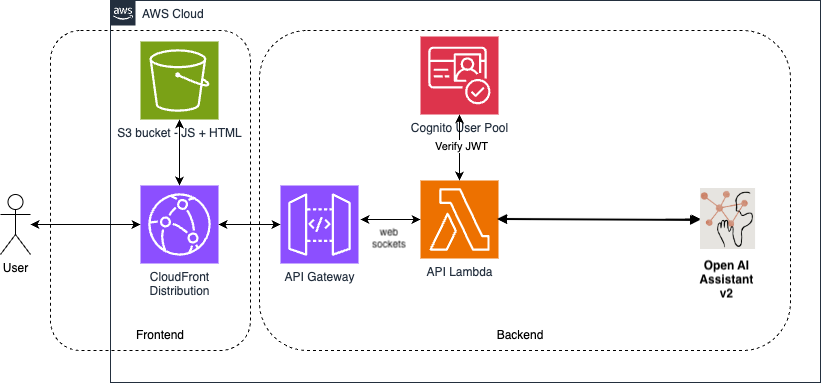

# Serverless Assistant Chat

A simple web application demonstrating the use of AWS Lambda serverless with stateful `OpenAI Assistant API v2` LLM to interact with via a simple web chat interface. 

Both backend and frontend are implemented with TypeScript.

The architecture of the application is illustrated below:-



## Environment

Set these environment variables with your own values. Bucket names are globally unique.

I use a `.env` file with `direnv`. Otherwise prefix these with "export".

```sh
# BACKEND
AWS_REGION=us-east-2
STACK_NAME=serverless-assistant-chat
BE_DEPLOYMENT_BUCKET=serverless-assistant-chat
FE_DEPLOYMENT_BUCKET=serverless-assistant-chat-fe
USER_EMAIL=you@example.com
OPENAI_API_KEY=yourkey
ASSISTANT_ID=

# FRONTEND
REGION=                     # Your AWS region
USER_POOL_ID=               # `CognitoUserPoolID` - the user pool id
USER_POOL_WEB_CLIENT_ID=    # `CognitoAppClientID` - the app client id
API_ENDPOINT=               # `ServiceEndpointWebsocket` - the address of the API Gateway WebSocket
DOMAIN_NAME=                # `DomainName` - the domain of the CloudFront distribution
```

## Create Assistant Instance

### Roll your own
Using the same account as your `OPENAI_API_KEY` you can roll your own and use the [OpenAI Assistant API v2](https://platform.openai.com/docs/api-reference/chat/create) to create an assistant instance.


### Python script
Or, create an Assistant instance using our python script.

Create a Python 3.10+ venv and install the [requirements.txt](admin/requirements.txt).

Optionally update the `instructions` field in [assistant.yml](./admin/assistant.yml).

Deploy it to OpenAI with:

```sh
make upsert-assistant
```

Upon success you'll get an assistant ID.  You'll need this.  

- Update the `assistant.yml` file and give the `AssistantId` field this value.
This allows you to update the prompt and update the existing assistant instance.
- add `ASSISTANT_ID=yourvalue` to your environment (.env)

## Backend
Before creating the insfrastructure via the Cloud Formation template, build the backend
Lambda code and place it in S3 for the Lambda deployment by following the steps below

### Create the bucket to hold the built Lambda code
First we create an S3 bucket to hold the deployable Lambda code (remember S3 bucket names are globally unique). 

```sh
make create-bucket
```

### Build Backend

We then transpile and webpack the backend Typescript code by running the following command

```sh
make build-backend
```

### Deploy Backend

Finally we build and deploy our Lambda code by running the following command

```sh
make deploy-backend
```

### Build Backend Lambda Layer

We need to give our backend access to the OpenAI API.  
We do this by creating a Lambda layer that contains the OpenAI NodeJS SDK and dependencies.

```sh
make prepare-layer
```

### Deploy Backend Lambda Layer

We have to deploy our Lambda layer to S3.

```sh
make create-layer
```

## Infrastructure

Once we have the Lambda artifact built and ready to be deployed, we can deploy the supplied Cloud Formation template that will create all the required infrastructure (Lambda, API Gateway, S3 bucket, CloudFront distro, Cognito items etc.)

### Deployment

- Install AWS SAM CLI (if not already installed):
    - Follow the [AWS SAM installation guide](https://docs.aws.amazon.com/serverless-application-model/latest/developerguide/install-sam-cli.html).
- Prepare the CloudFormation deployment:
    - `make prepare-cf`
- Deploy the CloudFormation deployment:
    - `make deploy-cf`

### Cloudformation outputs
When the CloudFormation stack has successfully completed, in the outputs make note of the following parameters that you will need to add to the `.env` file before you build and deploy the frontend code.

Update the `.env` file with the following vars:

- `REGION`, `USER_POOL_ID`, `USER_POOL_WEB_CLIENT_ID`, `API_ENDPOINT`, `DOMAIN_NAME`

## Frontend

### Build
To build the frontend code, run the following command from the project root directory.

```sh
make build-frontend
```

### Deploy
To build and deploy the frontend, run the following command from the project root directory. The `FE_DEPLOYMENT_BUCKET` is the name of the bucket provided when deploying the CloudFormation template in the previous step.

```sh
make deploy-frontend
```

### Use
Check your email for a welcome email from Cognito with a temporary password.

Then you can navidate to the CloudFront domain that was created by the CloudFormation stack (`DOMAIN_NAME`), enter your email address and password and start to use the application.


## Making changes after stack deployment

### Frontend

Deploying front-end changes take effect immediately.

```sh
make deploy-frontend
```

### Backend

Deploying backend-end changes require a stack update to take effect.

```sh
make deploy-cf
```
